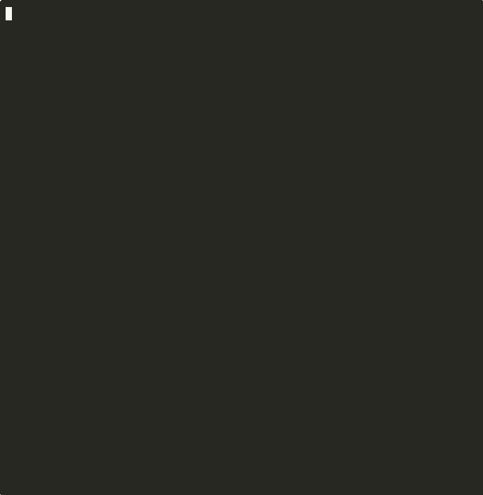

# OdinForge AI
*by Six Sense Enterprise Services*


**AI-powered exploit validation. Real vulnerabilities, real proof.**

OdinForge is an autonomous security platform that finds vulnerabilities and proves they're exploitable — with actual HTTP evidence, not AI guesses. It chains individual findings into full breach paths across your web apps, cloud infrastructure, and network perimeter.

---

## What It Does

Most security tools tell you something *might* be vulnerable. OdinForge shows you the request, the response, and the exploit chain that proves it.

- **Finds and validates vulnerabilities** — SQL injection, XSS, SSRF, auth bypass, path traversal, command injection. Every finding includes the HTTP request/response that confirms it.
- **Chains them into breach paths** — A single SQLi isn't a breach. OdinForge chains app compromise → credential extraction → cloud escalation → lateral movement into a full attack narrative.
- **Scores with real data** — EPSS probability, CVSS vectors, and CISA KEV status. Deterministic formula, not LLM vibes. Same approach as Qualys TruRisk and Tenable VPR.
- **Tests your cloud too** — AWS IAM escalation paths, Azure RBAC misconfigs, GCP service account analysis, Kubernetes RBAC breakouts. Not just web apps.
- **Runs continuously in CI** — Benchmarked on every push. If detection drops, the build fails.

---

## OdinForge in Action

<table>
<tr>
<td width="50%">

**Exploit Agent Benchmark**



</td>
<td width="50%">

**Breach Chain Validation**


</td>
</tr>
</table>

Real output from OdinForge's exploit agent running against OWASP Juice Shop:

```
═══════════════════════════════════════════════════════════
  OdinForge AI — Exploit Agent Benchmark
═══════════════════════════════════════════════════════════
  Target:    OWASP Juice Shop (v17.1.1)
  Mode:      simulation
  Scenarios: 5

▶ Search Parameter SQL Injection
  [js-search-sqli] Executing validate_vulnerability...
  [js-search-sqli] Executing http_fingerprint...
  [js-search-sqli] Completed in 13.1s                    ✅ PASS

▶ Login Authentication Bypass
  [js-login-auth] Executing validate_vulnerability...
  [js-login-auth] Completed in 9.1s                      ✅ PASS

▶ API Attack Surface Analysis
  [js-api-surface] Executing http_fingerprint...
  [js-api-surface] Executing port_scan...
  [js-api-surface] Executing validate_vulnerability...
  [js-api-surface] Completed in 21.4s                    ✅ PASS

▶ Stored XSS via Feedback
  [js-xss-feedback] Executing validate_vulnerability...
  [js-xss-feedback] Completed in 12.1s                   ✅ PASS

▶ Path Traversal & File Access
  [js-file-traversal] Executing validate_vulnerability...
  [js-file-traversal] Completed in 12.6s                 ✅ PASS

═══════════════════════════════════════════════════════════
  Scenarios:        5/5 passed (100%)
  Detection Rate:   9/10 expected vulns found (90%)
  Tool Calls:       19 total
  Total Time:       76.9s
═══════════════════════════════════════════════════════════
```

Not cherry-picked. This is the same benchmark that runs in CI on every push. [See full results →](docs/BENCHMARKS.md)

---

## How It Works

OdinForge runs an **agentic exploit loop** — not a single prompt-and-pray LLM call. The agent reasons about what to test, picks the right tool, analyzes the result, and decides what to do next. Up to 12 turns per engagement.

**9 tools across 2 agentic agents:**

| Agent | Tool | What it does |
|-------|------|-------------|
| Exploit | `validate_vulnerability` | Tests for SQLi, XSS, SSRF, command injection, path traversal, auth bypass |
| Exploit | `fuzz_endpoint` | Smart payload fuzzing with type mutation and encoding tricks |
| Exploit | `http_fingerprint` | Tech stack detection, security headers, auth surface mapping |
| Exploit | `port_scan` | TCP port scanning with service identification |
| Exploit | `check_ssl_tls` | Certificate, protocol, and cipher analysis |
| Exploit | `run_protocol_probe` | SMTP relay, DNS misconfig, LDAP anonymous bind, default creds |
| Business Logic | `test_idor` | Horizontal/vertical IDOR with ID enumeration and admin endpoint probing |
| Business Logic | `test_race_condition` | Double-spend, TOCTOU, limit bypass via concurrent requests |
| Business Logic | `test_workflow_bypass` | Step skipping, state manipulation, parameter tampering |

**Pipeline:** External recon (real scanning) → LLM recon → Plan agent (prioritized attack plan) → Exploit + Business Logic + Multi-Vector (parallel) → Debate (adversarial validation) → Lateral + Impact → Synthesis. Conditional gates skip unnecessary stages.

**Alloy mode:** The agent can rotate between GPT-4o, Claude, and Gemini per-turn for exploit diversity. Same approach XBOW uses. Configurable — single model by default.

**Breach chains:** 9 playbooks across 8 exploit categories (SQLi, path traversal, command injection, auth bypass, SSRF, IDOR, race conditions, workflow bypass). Each playbook chains multi-step attacks: detection → exploitation → data extraction → privilege escalation → lateral movement. Real-time visualization via WebSocket.

---

## Benchmark Results

### Exploit Agent (per-target)

| Target | Scenarios | Pass Rate | Detection | Time |
|--------|-----------|-----------|-----------|------|
| OWASP Juice Shop v17.1.1 | 5 | 5/5 (100%) | 90% | 76.9s |
| DVWA | 5 | CI runs (non-blocking) | Tuning | — |
| WebGoat v2023.8 | 4 | CI runs (non-blocking) | Tuning | — |

### XBOW CTF Benchmark (10/104 challenges — preliminary)

| Agent | Mode | Solve Rate | Vuln Detection |
|-------|------|-----------|----------------|
| **OdinForge** | Black-box (no source) | 0/10 | **6/10 (60%)** |
| Shannon Lite | White-box (full source) | 96.15% | — |
| XBOW (official) | Black-box | 85% | — |

OdinForge detected vulnerabilities in 60% of challenges but couldn't extract flags (requires deeper exploitation beyond initial detection). Nightly CI runs all 104 challenges. Shannon's 96.15% used full source code access.

### AEV Breach Chain (multi-phase) — avg score 47/100

| Scenario | Score | Steps | Confidence |
|----------|-------|-------|------------|
| SQLi to Data Exfiltration | 58/100 | 1/1 | 60% |
| Auth Bypass to Priv Escalation | 44/100 | 1/2 | 70% |
| Path Traversal File Read | 45/100 | 1/2 | 75% |
| Multi-Vector Attack Chain | 41/100 | 1/2 | 60% |

Breach chains go beyond single-vuln detection: SQLi → credential extraction → privilege escalation → lateral movement. Neither Shannon nor XBOW supports multi-phase chaining.

Benchmarks run in CI via GitHub Actions with threshold gating. If pass rate or detection rate drops below the threshold, the build fails. Results are public.

[See full results →](docs/BENCHMARKS.md) | [Public benchmark page →](http://24.199.95.237/benchmark) | [CI Workflows →](.github/workflows/)

---

## Quick Start

```bash
git clone https://github.com/Odingard/OdinForgeAI.git
cd OdinForgeAI
npm install

# Configure
cp .env.example .env
# Set: DATABASE_URL, OPENAI_API_KEY, JWT_SECRET

# Start infrastructure
docker-compose up -d   # PostgreSQL + Redis

# Initialize database
npm run db:push

# Start
npm run dev
```

Open `http://localhost:5000`. That's it.

### Run a Benchmark Locally

```bash
docker run -d --name juice-shop -p 3001:3000 bkimminich/juice-shop:v17.1.1
npx wait-on http://localhost:3001
npx tsx server/benchmark/exploit-benchmark.ts http://localhost:3001 simulation --target juice-shop
docker rm -f juice-shop
```

---

## Documentation

- [Documentation Hub](docs/README.md)
- [Benchmark System](docs/BENCHMARKS.md) — Run benchmarks, add targets, CI integration
- [Scoring Engine](docs/SCORING_ENGINE.md) — EPSS + CVSS + KEV deterministic formula
- [API Reference](docs/API_REFERENCE.md) — 200+ REST endpoints
- [Server Setup](docs/server/installation.md) | [Configuration](docs/server/configuration.md) | [Production Deploy](docs/server/production.md)
- [Agent Installation](docs/agent/INSTALL.md) — Linux, macOS, Windows endpoint agents

---

## Early Access

OdinForge is in active development. Here's what's where:

| Area | Status |
|------|--------|
| Exploit agent (agentic loop, 6 tools, plan phase, validation) | Production — benchmarked in CI |
| Business logic agent (agentic loop, 3 tools: IDOR, race conditions, workflow bypass) | Production |
| Threat intel scoring (EPSS, CVSS, KEV) | Production |
| Breach chain orchestration | Production — real-time visualization |
| Dashboard, evaluations, reporting | Production |
| Multi-tenant auth (JWT, RBAC, RLS) | Production |
| Cloud security (AWS/Azure/GCP/K8s) | Beta |
| Purple team simulations | Beta |
| Endpoint agents (Go) | Beta |
| XBOW CTF benchmark (104 challenges) | In progress — nightly CI |
| DVWA + WebGoat benchmarks | In progress — experimental CI |
| Breach chain benchmark | Production — CI with scoring |
| Alloy mode (multi-model rotation) | In progress |

We ship fast and break nothing. The exploit engine and scoring are production-tested. Enterprise features are landing weekly.

---

## Get in Touch

Building or evaluating? We'd like to hear from you.

- **Email:** [contact@Odingard.com](mailto:contact@Odingard.com)
- **Book a demo:** [contact@Odingard.com](mailto:contact@Odingard.com?subject=OdinForge%20Demo%20Request)
- **Issues:** [GitHub Issues](https://github.com/Odingard/OdinForgeAI/issues)

---

## Disclaimers

- OdinForge is a security testing tool. Only use it against systems you own or have explicit written authorization to test.
- Benchmark results are point-in-time measurements against specific vulnerable applications. Detection rates may vary across different targets and configurations.
- The exploit agent operates in three modes: **safe** (passive only), **simulation** (safe payloads), and **live** (full exploitation). Live mode requires human-in-the-loop approval.
- AI-generated findings should be validated by qualified security professionals before acting on them.

---

## License

Business Source License 1.1 (BSL 1.1) — see [LICENSE](LICENSE) for details.

Converts to Apache 2.0 on February 1, 2030.

---

© 2026 Six Sense Enterprise Services LLC. OdinForge is a trademark of Six Sense Enterprise Services LLC.
