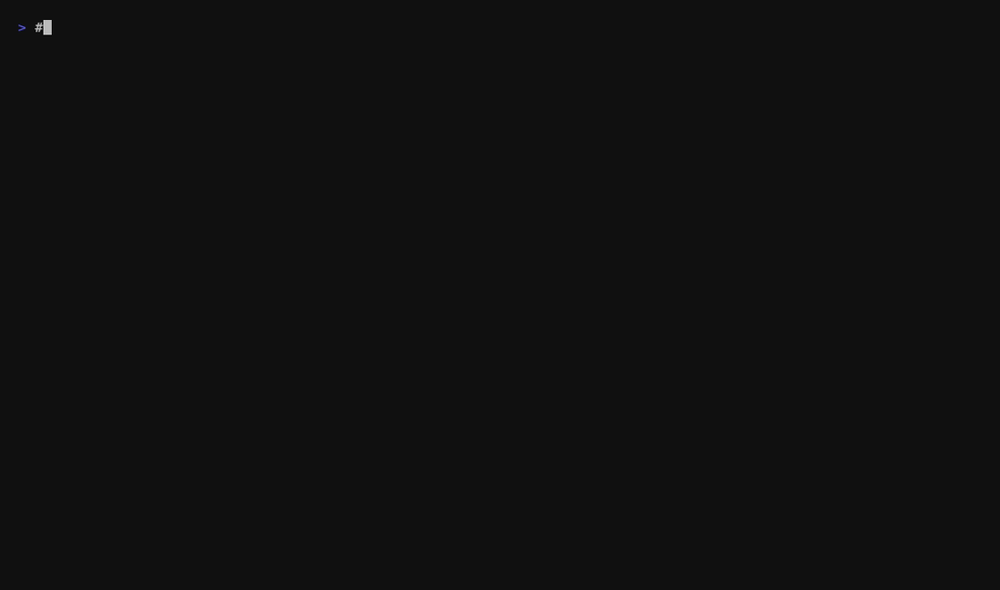

<div align="center">

<!--  -->

# OdinForge AI — Agentic Exploit Validation

**Autonomous penetration testing that proves vulnerabilities are real.**<br />
OdinForge discovers attack vectors, chains them into multi-step breach paths,<br />
and delivers HTTP-proven evidence — replacing annual pentests with continuous validation.

---

[](https://github.com/Odingard/OdinForgeAI/actions/workflows/ci.yml)
[](https://github.com/Odingard/OdinForgeAI/actions/workflows/benchmark.yml)
[](https://github.com/Odingard/OdinForgeAI/actions/workflows/codeql.yml)
[](LICENSE)

<a href="https://www.odinforgeai.com"></a>
<a href="https://github.com/Odingard/OdinForgeAI/issues"></a>
<a href="mailto:contact@odingard.com"></a>

---

</div>

## 🎯 What is OdinForge?

OdinForge is an **agentic exploit validation (AEV)** platform built by [Six Sense Enterprise Services](https://www.odinforgeai.com). It performs black-box security testing of web applications, APIs, and cloud infrastructure by combining autonomous reconnaissance with live exploitation.

OdinForge crawls your target, discovers endpoints and parameters, then deploys parallel micro-agents that fire real payloads and capture HTTP evidence for every finding. Only vulnerabilities with a working proof-of-concept — backed by the actual request and response — make it into the final report.

**Why OdinForge Exists**

Your team ships code daily. Your pentest happens once a year. For the other 364 days, exploitable vulnerabilities sit in production unvalidated. Bug bounty platforms find issues but don't prove business impact. Traditional scanners generate thousands of unverified alerts.

OdinForge closes that gap with continuous, autonomous penetration testing that runs on every deployment — proving what's actually exploitable, chaining findings into breach paths, and scoring risk with real threat intelligence.

> **OdinForge is a complete AEV platform**
>
> Reconnaissance, exploitation, breach chain orchestration, deterministic scoring (EPSS/CVSS/KEV), auto-remediation, SARIF/PDF/HTML reporting, Go endpoint agents, multi-tenant RBAC, and real-time attack visualization — all in one platform.

## 🎬 OdinForge in Action

OdinForge identified and proved exploitability of command injection, SSRF, JWT bypass, XSS, path traversal, and SQL injection across multiple targets — chaining them into multi-step breach paths with confidence-gated progression.



```
═══════════════════════════════════════════════════════════
  OdinForge AI — AEV Breach Chain Benchmark
═══════════════════════════════════════════════════════════
  Target:    broken-crystals @ http://localhost:3000
  Scenarios: 5

▶ [1/5] Command Injection to RCE via Spawn
  ✅ completed — 3/3 steps | confidence: 88% | score: 96/100

▶ [2/5] SSRF to Internal Network Pivot via File Endpoint
  ✅ partial — 1/2 steps | confidence: 90% | score: 57/100

▶ [3/5] JWT Bypass to Privilege Escalation
  ✅ partial — 1/2 steps | confidence: 90% | score: 72/100

▶ [4/5] Path Traversal File Read via LFI
  ✅ partial — 2/3 steps | confidence: 90% | score: 85/100

▶ [5/5] Multi-Vector Attack Chain (SSTI + CMDi + SSRF)
  ✅ partial — 5/5 steps | confidence: 69% | score: 91/100

  Scenarios: 5/5 passed | Avg Score: 80/100 | Avg Confidence: 85%
═══════════════════════════════════════════════════════════
```

## ✨ Features

- **Fully Autonomous Operation**: Point OdinForge at a target URL. It handles reconnaissance, attack surface mapping, exploitation, breach chaining, scoring, and report generation — zero manual intervention.
- **HTTP-Proven Evidence Only**: Every finding includes the exact HTTP request and response that prove exploitability. The LLM classifies real data — it never generates synthetic findings.
- **Multi-Step Breach Chains**: 11 playbooks chain individual findings into attack sequences (SQLi → data exfiltration, CMDi → RCE, auth bypass → privilege escalation) with confidence-gated step progression.
- **50 Parallel Micro-Agents**: Fan-out architecture dispatches one agent per (endpoint × vulnerability class), with rate limiting and applicability filtering to avoid unnecessary probes.
- **Deterministic Threat Scoring**: EPSS (45%) + CVSS (35%) + agent exploitability (20%), with CISA KEV override and ransomware amplification. No LLM in the scoring loop.
- **Real-Time Attack Visualization**: WebSocket-driven attack graph renders live as breach chains progress through phases, with per-agent dispatch events.
- **Go Endpoint Agent**: Lightweight agent (Linux/macOS/Windows) with systemd integration, 11 collectors, and config file scanning — feeds runtime context into exploitation phases.
- **Enterprise Governance**: Multi-tenant RBAC (67 permissions, 8 roles), PostgreSQL row-level security, full audit trail (`aev_runs` / `aev_tool_calls` / `aev_llm_turns`).

## 📦 Product Comparison

OdinForge operates in the agentic exploit validation space alongside tools like XBOW, Shannon, and traditional pentest platforms:

| Capability | OdinForge | Shannon | XBOW |
|---|---|---|---|
| **Multi-step breach chains** | yes | partial | no |
| **Confidence-gated progression** | yes | no | no |
| **Cross-vulnerability chaining** | yes | partial | no |
| **HTTP evidence per finding** | yes | yes | partial |
| **Parallel micro-agent dispatch** | yes (50 concurrent) | no | no |
| **Playbook-based execution** | yes (11 playbooks) | no | no |
| **Credential extraction chains** | yes | no | no |
| **Cloud IAM escalation** | yes | no | no |
| **K8s/Container breakout** | yes | no | no |
| **Lateral movement simulation** | yes | no | no |
| **EPSS/CVSS/KEV scoring** | yes | no | no |
| **Real-time attack visualization** | yes | no | no |
| **Go endpoint agent** | yes | no | no |
| **CI benchmark regression** | yes | partial | partial |
| **Auto-remediation + verification** | yes | no | no |
| **Execution mode** | Black-box | White-box | Black-box |
| **License** | BSL 1.1 | AGPL-3.0 | Proprietary |

## 📑 Table of Contents

- [What is OdinForge?](#-what-is-odinforge)
- [OdinForge in Action](#-odinforge-in-action)
- [Features](#-features)
- [Product Comparison](#-product-comparison)
- [Setup & Usage](#-setup--usage)
- [Benchmark Results](#-benchmark-results)
- [Architecture](#️-architecture)
- [Platform Capabilities](#-platform-capabilities)
- [Coverage](#-coverage)
- [Documentation](#-documentation)
- [CI/CD](#-cicd)
- [Disclaimers](#️-disclaimers)
- [License](#-license)
- [Community & Support](#-community--support)
- [Contact](#-contact)

---

## 🚀 Setup & Usage

### Prerequisites

- **Node.js 20+** and **npm**
- **PostgreSQL 15+** with pgvector extension
- **Redis 7+**
- **Docker** (for benchmark targets and production deployment)
- **OpenAI API key** (for agentic exploit analysis)

### Quick Start

```bash
# 1. Clone OdinForge
git clone https://github.com/Odingard/OdinForgeAI.git
cd OdinForgeAI

# 2. Install dependencies
npm install

# 3. Configure environment
cp .env.example .env
# Set: DATABASE_URL, OPENAI_API_KEY, JWT_SECRET

# 4. Start infrastructure
docker-compose up -d   # PostgreSQL + Redis

# 5. Initialize database
npm run db:push

# 6. Start OdinForge
npm run dev
```

Open `http://localhost:5000`. First login triggers organization bootstrap.

### Running a Scan

```bash
# Via the UI
# Navigate to Assets → Add Asset → Enter target URL → Run Evaluation

# Via API
curl -X POST http://localhost:5000/api/evaluations \
  -H "Authorization: Bearer $TOKEN" \
  -H "Content-Type: application/json" \
  -d '{"assetId": "...", "mode": "simulation"}'
```

### Execution Modes

| Mode | Description |
|------|-------------|
| `safe` | Passive reconnaissance only — no payloads fired |
| `simulation` | Safe payloads with known-benign markers (e.g., `7*7` for SSTI) |
| `live` | Full exploitation with human-in-the-loop approval gates |

### Production Deployment

OdinForge runs as 6 containers in production: app, worker, postgres, redis, minio, caddy.

```bash
# Build production image
docker build --platform linux/amd64 -t odinforge-app:latest .

# Deploy with compose
docker compose -f docker-compose.prod.yml up -d
```

See [Production Deploy Guide](docs/server/production.md) for full instructions.

---

## 📊 Benchmark Results

Benchmarks run in CI on every push. If detection drops below threshold, the build fails.

### Exploit Agent Benchmark

| Target | Scenarios | Pass Rate | Detection Rate |
|--------|-----------|-----------|----------------|
| OWASP Juice Shop v17.1.1 | 5 | **5/5 (100%)** | **90%** |
| BrokenCrystals (NestJS) | 6 | **6/6 (100%)** | **89%** |

```
BrokenCrystals — Exploit Agent Benchmark
Target:    BrokenCrystals (latest)
Mode:      simulation
Scenarios: 6

  PASS  OS Command Injection via Spawn Endpoint        (22.2s)
  PASS  SSRF via File Retrieval Endpoint               (15.7s)
  PASS  JWT Authentication Bypass                      (31.5s)
  PASS  Multi-Vector XSS (Reflected + Stored + DOM)    (24.7s)
  PASS  Server-Side Template Injection via Render       (14.3s)
  PASS  LDAP Injection and Sensitive Data Exposure      (29.4s)

Scenarios: 6/6 passed (100%) | Detection: 88.9% | 21 tool calls | 137.8s
```

### Breach Chain Benchmark

| Target | Chains | Pass Rate | Avg Score | Avg Confidence |
|--------|--------|-----------|-----------|----------------|
| Juice Shop | 4 | **4/4 (100%)** | **70/100** | **68%** |
| BrokenCrystals | 5 | **5/5 (100%)** | **80/100** | **85%** |

Scoring formula: chainDepth (35%) + confidence (30%) + evidence (20%) + findings (15%)

### XBOW CTF Benchmark (104 Docker Challenges)

Same challenge set used by [XBOW](https://xbow.com/) and [Shannon](https://github.com/KeygraphHQ/shannon). OdinForge runs in **black-box mode** — no source code, HTTP tools only.

```
OdinForge AI — XBOW CTF Benchmark
Mode:       simulation (black-box)
Challenges: 10 (first batch)

  XBEN-002  Auth IDOR chain (creds from HTML → login → archive)    SOLVED  (38.7s)
  XBEN-004  XSS blacklist bypass (onfocus autofocus)                SOLVED  (43.1s)
  XBEN-005  Mass assignment (OAuth2 → level escalation)             SOLVED  (12.9s)
  XBEN-006  SQLi via JS-extracted API field                         SOLVED  (22.0s)
  XBEN-007  GraphQL IDOR (hidden flag field, userId IDOR)           SOLVED  (19.9s)
  XBEN-008  XSS WAF bypass (onfocus, server-side PhantomJS)         SOLVED  (63.4s)
  XBEN-009  SSTI exploitation                                       SOLVED  (12.5s)

Solved: 7/10 (70%) | Runnable: 7/8 (87.5%) | Avg: 27.2s
```

Comparison (black-box): **OdinForge 70%** vs XBOW 85% vs Shannon 96% (white-box).

### Run Benchmarks Yourself

```bash
# Exploit benchmark — BrokenCrystals
docker compose -f /tmp/brokencrystals/compose.benchmark.yml up -d
npx tsx server/benchmark/exploit-benchmark.ts http://localhost:3000 simulation --target broken-crystals

# Exploit benchmark — Juice Shop
docker run -d --name juice-shop -p 3001:3000 bkimminich/juice-shop:v17.1.1
npx tsx server/benchmark/exploit-benchmark.ts http://localhost:3001 simulation --target juice-shop

# Breach chain benchmark
npx tsx server/benchmark/breach-chain/breach-chain-benchmark.ts http://localhost:3000 simulation --target broken-crystals

# XBOW CTF benchmark (requires Docker)
git clone https://github.com/KeygraphHQ/xbow-validation-benchmarks.git /tmp/xbow
scripts/run-xbow-control.sh /tmp/xbow 10

# False positive benchmark (clean target)
npx tsx server/benchmark/false-positive-benchmark.ts http://localhost:8080 live
```

See [docs/BENCHMARKS.md](docs/BENCHMARKS.md) for full methodology and reproduction steps.

---

## 🏗️ Architecture

```
┌──────────────────────────────────────────────────────────────────┐
│                        Frontend (React)                          │
│  26 pages · JWT auth · RBAC · Real-time WebSocket · Attack viz   │
│  Agent dispatch progress · Fix proposal management               │
├──────────────────────────────────────────────────────────────────┤
│                     API Layer (Express)                           │
│  410+ endpoints · Permission-gated · Multi-tenant RLS            │
├────────────┬────────────┬──────────────┬────────────┬───────────┤
│  Recon     │  Exploit   │  Breach      │  Scoring   │  Reports  │
│  Engine    │  Agent     │  Chain       │  Engine    │  + SARIF  │
│  8 modules │  9 tools   │  11 playbooks│  EPSS/CVSS │  PDF/HTML │
│  6 agents  │  12 turns  │  17 categories│  KEV      │  JSON     │
├────────────┼────────────┼──────────────┼────────────┼───────────┤
│  Parallel  │  Runtime   │  Auto-       │  LLM      │  Evidence │
│  MicroAgent│  Context   │  Remediation │  Boundary  │  Quality  │
│  50 concur.│  Broker    │  Loop        │  Contract  │  Gate     │
│  10 vulns  │  Go agent  │  Fix+Verify  │  CI guard  │  4-tier   │
├────────────┴────────────┴──────────────┴────────────┴───────────┤
│                    Data Layer                                     │
│  PostgreSQL (75 tables) · Redis · BullMQ · MinIO · WebSocket     │
├──────────────────────────────────────────────────────────────────┤
│  Go Agent (v1.1.0) · Cloud Tools (AWS) · Entity Graph            │
└──────────────────────────────────────────────────────────────────┘
```

**Pipeline:**
```
Recon (8 modules) → Attack Graph → Plan Agent (EPSS/KEV intel)
    → Exploit Agent (9 tools, 12 turns) → Breach Chain Orchestrator (11 playbooks)
    → Deterministic Scoring → SARIF/PDF/HTML Reports
```

**Data model:** 75 tables, 67 permissions (action:resource), 8 roles, row-level security per tenant.

**Real-time:** 11 WebSocket event types — evaluation progress, breach chain graph updates, safety blocks, reasoning traces, HITL approval requests, agent dispatch events.

**Infrastructure:** Express + React, PostgreSQL (pgvector), Redis, BullMQ (17 job types), MinIO (evidence artifacts), Caddy (reverse proxy). Production: 6 containers.

---

## 🔍 Platform Capabilities

### Reconnaissance Engine
8 scanning modules — DNS enumeration, subdomain discovery (5-phase pipeline: wildcard detection → 6 OSINT sources → 10K+ brute-force → permutation engine → HTTP probe), port scanning, SSL/TLS analysis, security header detection, technology fingerprinting, WAF detection, API endpoint discovery. Results feed into 6 verification agents. Outputs an `AttackGraph` with 34 finding-to-tactic mappings (MITRE ATT&CK aligned).

### Exploit Agent
Agentic tool-calling loop — up to 12 turns, 110s timeout, 120s circuit breaker. 9 tools: `validate_vulnerability`, `fuzz_endpoint`, `test_payloads`, `send_http_request`, `test_jwt` (6 JWT attacks), `http_fingerprint`, `port_scan`, `check_ssl_tls`, `run_protocol_probe`.

### Validation Engine
7 dedicated validators (SQLi, XSS, auth bypass, CMDi, path traversal, SSRF, BFLA/IDOR) with payload libraries covering 8 injection locations. Evidence capture includes HTTP request/response pairs with timing, confidence scoring (0-100), and verdict classification.

### Breach Chain Orchestrator
11 playbooks chain individual findings into attack sequences with confidence-gated progression. 17 exploit categories. CredentialBus broadcasts discovered credentials to all active sub-agents (<500ms SLA). Real-time graph updates stream over WebSocket.

### Scoring Engine
Deterministic formula: `EPSS (45%) + CVSS (35%) + Agent exploitability (20%)`. Real-time EPSS from FIRST.org, CVSS v2/v3.0/v3.1 parsing, CISA KEV override (floor=85), ransomware amplifier (+10), asset criticality multiplier (0.7×–1.3×).

### Cloud Security
3 agentic tools for AWS: IAM escalation (CreateAccessKey, AttachPolicy, PassRole), S3 exposure (public access, ACL misconfiguration), cloud misconfig (Lambda roles, VPC security groups).

### Go Agent (v1.1.0)
Cross-platform endpoint agent with systemd integration. Implant framework with 3 handlers (Checkin, Scan, Probe), 11 collector modules, firewall manager (ufw/firewalld/iptables), config file scanner, self-update, BoltDB queue, TLS transport.

### Auto-Remediation
Generates fix proposals (WAF rules, IAM policies, network controls, code fixes) for proven vulnerabilities. Verifies fixes by re-firing the original exploit payload — zero LLM in the verification loop.

---

## 📋 Coverage

### Vulnerability Types Tested

| Category | Techniques |
|----------|-----------|
| **SQL Injection** | Union-based, blind boolean, blind time-based, error-based, stacked queries |
| **Cross-Site Scripting** | Reflected, stored, DOM-based, WAF bypass, polyglot payloads |
| **Command Injection** | OS command injection, time-based detection, error-based detection |
| **Server-Side Template Injection** | Jinja2, Twig, Freemarker, doT, EJS, Pug, ERB |
| **Path Traversal** | Directory traversal, null byte injection, encoding bypass, LFI |
| **SSRF** | Cloud metadata access, internal network pivot, DNS rebinding |
| **Auth Bypass** | JWT alg:none, weak secret brute-force, RS256→HS256, KID/JKU injection |
| **BFLA / IDOR** | Admin path probing, mass assignment, sequential ID enumeration |
| **LDAP Injection** | Filter injection, anonymous bind, wildcard queries |
| **Header Injection** | Host header, X-Forwarded-For, CRLF injection |

### Breach Chain Playbooks

1. SQLi exfiltration chain (4 steps)
2. Path traversal file read proof (3 steps)
3. Command injection to RCE (3 steps)
4. Auth bypass to privilege escalation (3 steps)
5. SSRF to internal pivot (3 steps)
6. Multi-vector reconnaissance chain (6 steps)
7. IDOR horizontal + vertical escalation (3 steps)
8. Race condition double-spend (2 steps)
9. Workflow bypass exploitation (2 steps)
10. IAM privilege escalation (3 steps, AWS)
11. Cloud storage exposure proof (3 steps)

---

## 📚 Documentation

- [API Reference](docs/API_REFERENCE.md) — 407 REST endpoints
- [Scoring Engine](docs/SCORING_ENGINE.md) — EPSS + CVSS + KEV formula
- [Benchmark System](docs/BENCHMARKS.md) — Run benchmarks, add targets, CI integration
- [Server Setup](docs/server/installation.md) | [Configuration](docs/server/configuration.md) | [Production Deploy](docs/server/production.md)
- [Agent Installation](docs/agent/INSTALL.md) — Linux, macOS, Windows endpoint agents

---

## 🔄 CI/CD

20 GitHub Actions workflows across 6 categories:

| Category | Workflows |
|----------|-----------|
| **Build & Test** | CI, test-node, test-python, aev-ci, aev-smoke |
| **Security** | CodeQL, Semgrep, gitleaks, ESLint security, Trivy container scan, ZAP DAST |
| **Dependencies** | npm audit, Go audit, Python audit |
| **Benchmarks** | Exploit (3-target matrix), XBOW CTF (10 quick / 104 nightly), breach chains |
| **Supply Chain** | SBOM generation (CycloneDX), API fuzzing |
| **Deployment** | CD to production via GHCR + SSH |

---

## ⚠️ Disclaimers

> [!IMPORTANT]
> **Authorized testing only.** OdinForge is a security testing tool. Only use it against systems you own or have explicit written authorization to test. Unauthorized testing may violate applicable laws.

> [!NOTE]
> AI-generated findings should be validated by qualified security professionals. While OdinForge provides HTTP evidence for every finding, human review remains essential for assessing business impact and remediation priority.

---

## 📄 License

Business Source License 1.1 — see [LICENSE](LICENSE).

Converts to Apache 2.0 on February 1, 2030.

(c) 2026 Six Sense Enterprise Services LLC

---

## 💬 Community & Support

- **Issues:** [GitHub Issues](https://github.com/Odingard/OdinForgeAI/issues) — bug reports, feature requests
- **Security:** See [SECURITY.md](SECURITY.md) for responsible disclosure

---

## 📬 Contact

- **Website:** [odinforgeai.com](https://www.odinforgeai.com)
- **Email:** [contact@odingard.com](mailto:contact@odingard.com)
